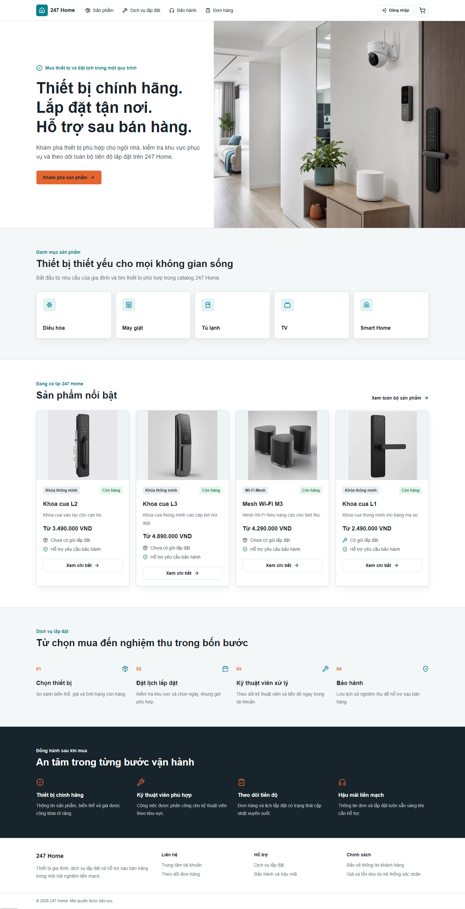

# Animation Implementation Report

Date: 2026-07-20

## Animation system

- Motion tokens and keyframes are centralized in `app/globals.css`.
- Durations are 160 ms for direct feedback, 240 ms for component transitions
  and 380 ms for reveals.
- Route templates provide a small fade/translate entry without remounting the
  customer, admin or technician shell.
- `Reveal` uses IntersectionObserver, runs once per element and leaves content
  visible in the server-rendered fallback.
- Buttons, cards, badges, alerts, toast, fields, tables, dialogs and navigation
  share consistent interaction timing.

## Components updated

| Experience | Motion applied |
| --- | --- |
| Home | Image fade, four-stage copy sequence, category/product stagger, service-line and trust reveal |
| Product catalog | Page/reveal entry, card lift, image scale, filter drawer, gallery and price transitions |
| Cart and checkout | Button press/loading behavior, pending line and quantity feedback |
| Orders and warranty | Timeline node/line transitions, upload pending and success/error feedback |
| Admin Operations | Metric-card lift, tab feedback, table-row focus, modal and mutation feedback |
| Technician | Job-card entry, tap feedback, timeline, evidence hover/upload and action confirmation |
| Navigation | Animated active indicator and current-page semantics |

## Libraries used

No dependency was added. The implementation uses CSS, React and the native
IntersectionObserver API already available in supported browsers.

## Performance decisions

- No blur animation, parallax, autoplay loop or large continuously animated
  decoration was introduced.
- Entry motion uses opacity and transform. Element dimensions remain stable.
- Hover lift runs only on devices with a fine pointer.
- Reveal observers disconnect immediately after the first intersection.
- Existing server rendering and data-fetch boundaries remain unchanged.

## Accessibility

- `prefers-reduced-motion: reduce` forces decorative animation and transition
  durations to effectively zero and restores visible reveal content.
- Active navigation now exposes `aria-current="page"`.
- Loading, alerts, dialogs, keyboard operation and focus-visible behavior are
  preserved.
- Animation never communicates status without existing text, icons or badges.

## Before and after evidence

Before implementation, the code audit found only spinner/pulse loading and
isolated hover transitions. Baseline and verified after screenshots are stored
under `docs/screenshots/animation/`:

- `before-home-1440.png`
- `before-home-768.png`
- `before-home-390.png`
- `before-products-1440.png`
- `after-home-1440.png`
- `after-home-768.png`
- `after-home-390.png`
- `after-products-1440.png`

| Baseline | Motion system |
| --- | --- |
|  |  |

The baseline was captured from the repository HEAD in an isolated temporary
worktree. Static frames intentionally remain visually consistent: the upgrade
adds timing, feedback and state continuity rather than changing layout.

## Test results

All results below were produced from the final working tree on 2026-07-20:

| Command | Result |
| --- | --- |
| `pnpm lint` | PASS, zero warnings |
| `pnpm typecheck` | PASS |
| `pnpm test` | PASS, 26 files and 90 tests |
| `pnpm test:integration` | PASS, 9 files and 63 tests |
| `pnpm test:e2e` | PASS, 45 Playwright tests |
| `pnpm build` | PASS, optimized Next.js production build |

Focused E2E coverage verifies navigation state, reveal visibility,
reduced-motion and horizontal overflow at 390, 768 and 1440 px. The complete
E2E run also covers the existing Customer, Admin Operations, Technician,
checkout, order and warranty journeys.

## Known limitations

- Native page View Transitions are not enabled because browser support and
  App Router lifecycle behavior are not required for this lightweight system.
- Upload APIs do not expose byte-level progress, so the UI provides deterministic
  pending/loading feedback rather than inventing a percentage.
- Static screenshots verify layout and visible end states; reduced-motion and
  interaction behavior are verified by Playwright assertions.
- Next.js development diagnostics still recommend prioritizing the first
  catalog product image when it becomes the page LCP. This is a low-risk image
  loading optimization and does not affect motion correctness or layout.

## Final status

247 HOME PREMIUM MOTION EXPERIENCE READY
