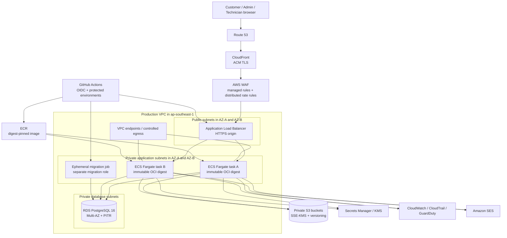

# Cloud Deployment Architecture

Status: **PROPOSED FOR APPROVAL**  
Decision date: 2026-07-15  
Scope: deployment architecture only; no application feature or application
architecture change is authorized by this document.

## 1. Executive summary

247 Home should be deployed as **Cloud Infrastructure (option B)** built from
managed AWS services in `ap-southeast-1` (Singapore). The single recommended
strategy is:

- Amazon CloudFront and AWS WAF at the public edge;
- an internet-facing Application Load Balancer (ALB);
- a private Amazon ECS service on AWS Fargate running the existing immutable OCI
  image;
- Amazon RDS for PostgreSQL 16, Multi-AZ in production;
- private Amazon S3 buckets using SSE-KMS;
- AWS Secrets Manager and KMS;
- Amazon ECR for digest-pinned images;
- GitHub Actions with AWS OIDC federation for CI/CD;
- CloudWatch, CloudTrail, GuardDuty and AWS Budgets for operations;
- RDS point-in-time recovery, pre-migration snapshots and encrypted backup copies.

This is not a recommendation to operate raw virtual machines or Kubernetes.
Fargate, RDS, S3 and the edge services remain managed. Cloud Infrastructure is
selected because the production trust boundaries, database integrity, private
object storage, distributed rate limiting, immutable promotion and auditability
need to be controlled as one system. A simple application PaaS would reduce the
initial deployment work but would fragment these controls across several
providers.

The production launch remains blocked until every launch gate in section 8.3 is
closed. In particular, infrastructure cannot compensate silently for the current
local-only password-reset mailer or local-only product-image storage. AWS WAF can
provide an approved distributed edge limiter, but its rules must be reviewed and
tested because WAF rate-based rules are not a precise transaction quota system.

## 2. System requirement analysis

### 2.1 Application profile

The following is derived from [ARCHITECTURE.md](./ARCHITECTURE.md),
[DATABASE_DESIGN.md](./DATABASE_DESIGN.md),
[API_CONTRACT.md](./API_CONTRACT.md), [THREAT_MODEL.md](./THREAT_MODEL.md),
[MVP_SCOPE_FREEZE.md](./MVP_SCOPE_FREEZE.md) and the current release documents.

| Area | Current requirement | Deployment consequence |
| --- | --- | --- |
| Framework | Next.js 16 App Router, React 19, TypeScript strict | Run the standalone Node.js server as a long-lived HTTP container |
| Runtime | Node.js 24, pnpm 11.16.0 at build/test time | Build once as OCI; runtime does not need pnpm or source checkout |
| Application shape | Modular monolith; stateless request handlers; no microservices | One ECS service is sufficient; do not introduce Kubernetes or a service mesh |
| Database | PostgreSQL 16 through Prisma; PostgreSQL-specific locks, constraints and transactions | Use managed PostgreSQL 16, never a compatibility layer or serverless non-PostgreSQL substitute |
| Storage | Private S3-compatible evidence adapter; product image flow is currently local-only | Use native S3 for evidence; production product-image upload remains a launch gate |
| Authentication | Auth.js credentials flow and secure server session cookies | Stable `NEXTAUTH_SECRET`, canonical HTTPS origin and correct trusted-proxy configuration are mandatory |
| Background work | No queue, worker, scheduler or cron is in the approved MVP | Do not provision a broker or worker service; managed backups and platform jobs are infrastructure concerns |
| Payments | COD and manual bank transfer; no payment gateway | No cardholder-data environment; order/payment audit data is still sensitive |
| Data sensitivity | Identity, phone, delivery address, installation details and evidence | Private networking, KMS encryption, least privilege and log redaction are required |
| Release | OCI standalone image, non-root runtime, immutable digest promotion, SBOM/provenance | Store in ECR and deploy `repository@sha256:digest`; never deploy `latest` |
| Time | Database and Node run UTC; business display uses `Asia/Ho_Chi_Minh` | Set `TZ=UTC`, verify PostgreSQL timezone and avoid host-local date conversion |

### 2.2 Traffic and scaling assumptions

The product documents define latency targets but not an approved RPS, concurrency
or availability SLA. Registered users are not a reliable capacity unit. The
following values are planning assumptions only and must be replaced by staging
measurements:

| Stage | Planning envelope | Initial topology |
| --- | --- | --- |
| MVP, 0-1,000 users | Up to 25 concurrent users, about 5 average and 20 burst requests/second | Two small production tasks, one Multi-AZ database |
| Growth, 1,000-10,000 users | Up to 150 concurrent users, about 20 average and 80 burst requests/second | Two to four tasks, larger database, connection-pool review |
| Scale, 10,000+ users | Unknown until workload mix and evidence volume are measured | Load-test driven capacity; no automatic database tier promise |

Autoscaling must protect PostgreSQL, not only add application tasks. ECS maximum
task count, Prisma pool size and database `max_connections` form one capacity
budget. At growth stage, add RDS Proxy if measured connection churn or pool count
justifies it; this is a connection endpoint change, not a domain architecture
change.

### 2.3 Availability and recovery objectives

These targets require product-owner approval before production:

- Production availability objective: 99.9% monthly for the application edge.
- Production RPO: no more than 5 minutes for PostgreSQL after PITR is enabled and
  restore evidence is current.
- Production RTO: no more than 60 minutes for a regional database restore and
  application redeployment runbook exercise.
- Staging RPO/RTO: 24 hours / 4 hours; staging is not customer-serving.
- Evidence objects: versioning plus lifecycle protection; restore and orphan
  reconciliation must be exercised separately from database restore.

## 3. Cloud provider decision

### 3.1 Evaluation method

Scores use a 1 to 5 scale. The weighted decision favors security and database
reliability because order, inventory and appointment correctness depend on real
PostgreSQL semantics.

| Criterion | Weight | Meaning for 247 Home |
| --- | ---: | --- |
| Security | 25% | Edge controls, IAM, private network, encryption and audit |
| Database reliability | 25% | PostgreSQL 16, HA, PITR, restore operations and observability |
| Scaling | 15% | Horizontal application scaling without overwhelming PostgreSQL |
| Deployment simplicity | 15% | OCI/digest fit and no application adapter change |
| Maintenance | 10% | Managed operations, upgrades and incident surface |
| MVP cost | 10% | Expected recurring cost at the first production tier |

### 3.2 Provider comparison

| Provider | Cost | Simplicity | Scaling | Database | Security | Maintenance | Weighted | Decision |
| --- | ---: | ---: | ---: | ---: | ---: | ---: | ---: | --- |
| Railway | 5.0 | 5.0 | 3.0 | 3.0 | 3.0 | 4.5 | 3.7 | Excellent prototype economics; weaker integrated production control plane |
| Render | 4.0 | 5.0 | 4.0 | 4.0 | 3.5 | 4.5 | 4.1 | Strong PaaS runner-up; private S3 and edge policy remain cross-provider |
| Fly.io | 4.0 | 3.5 | 4.0 | 3.5 | 3.5 | 3.5 | 3.6 | Flexible regions, but more topology and database operations burden |
| AWS | 2.5 | 4.0 | 5.0 | 5.0 | 5.0 | 4.0 | **4.5** | **Selected** |
| Azure | 3.0 | 2.5 | 5.0 | 5.0 | 5.0 | 3.5 | 4.3 | Technically capable; Blob Storage is not the existing S3 adapter target |
| Google Cloud | 4.0 | 2.0 | 5.0 | 5.0 | 5.0 | 3.0 | 4.3 | Cloud Run is compelling; native Cloud Storage would require an adapter change or a second storage provider |

Current public pricing confirms the PaaS cost advantage: Railway starts with a
small usage-included plan, Render lists low-cost web instances and managed
PostgreSQL tiers, and Fly bills small shared-CPU machines by use. Those prices do
not include an equivalent integrated production design for private object
storage, edge policy, KMS, database recovery and audit.

AWS wins for this project because:

1. The existing production evidence adapter uses the AWS S3 API and SDK directly.
2. RDS PostgreSQL preserves the required PostgreSQL behavior and provides managed
   Multi-AZ, backups and PITR.
3. WAF supplies a shared edge enforcement point before requests reach any ECS
   replica.
4. ECR, ECS and GitHub OIDC preserve the existing build-once, promote-by-digest
   release strategy.
5. IAM, KMS, Secrets Manager, S3, CloudTrail and CloudWatch create one auditable
   trust boundary.
6. `ap-southeast-1` has three Availability Zones and is geographically suitable
   for the initial Vietnam workload.

The tradeoff is a higher fixed MVP bill and greater infrastructure discipline.
That cost is accepted to avoid a second provider and an application storage
rewrite.

### 3.3 Official comparison sources

Pricing changes over time. Scores and estimates were reviewed on 2026-07-15
against official sources and must be recalculated in the provider calculators
before purchase:

- [Railway pricing](https://docs.railway.com/pricing/plans) and
  [private networking](https://docs.railway.com/private-networking)
- [Render pricing](https://render.com/pricing)
- [Fly.io pricing](https://fly.io/docs/about/pricing/)
- [AWS Fargate pricing](https://aws.amazon.com/fargate/pricing/),
  [RDS for PostgreSQL pricing](https://aws.amazon.com/rds/postgresql/pricing/)
  and [AWS WAF pricing](https://aws.amazon.com/waf/pricing/)
- [Azure Container Apps](https://learn.microsoft.com/en-us/azure/container-apps/overview)
  and [Azure Front Door pricing](https://azure.microsoft.com/en-us/pricing/details/frontdoor/)
- [Google Cloud Run](https://docs.cloud.google.com/run/docs/overview/what-is-cloud-run),
  [Cloud SQL for PostgreSQL](https://cloud.google.com/sql/postgresql) and
  [Cloud Armor pricing](https://cloud.google.com/armor/pricing)
- [AWS region inventory](https://docs.aws.amazon.com/global-infrastructure/latest/regions/aws-regions.html)

## 4. Recommended architecture

### 4.1 Production components

| Capability | Selected service | Required configuration |
| --- | --- | --- |
| Application hosting | ECS on Fargate | Two tasks minimum across two AZs; private subnets; no public IP; non-root image; rolling deployment with healthy minimum 100% |
| Load balancing | Application Load Balancer | HTTPS origin, `/api/health` liveness and `/api/ready` readiness; deregistration delay tested against request duration |
| Edge and CDN | CloudFront | Canonical hostname, TLS, compression; cache only explicitly public catalog/static paths |
| Web protection | AWS WAF | AWS managed baseline rules plus path-scoped rate rules; count mode before block mode |
| Database | RDS PostgreSQL 16 | Multi-AZ DB instance, gp3 encrypted storage, deletion protection, TLS, UTC, separate migration/runtime roles |
| Object storage | Amazon S3 | Separate private buckets/prefixes by environment and data class; Block Public Access; SSE-KMS; versioning and lifecycle |
| Container registry | Amazon ECR | Immutable tags, scan on push, retention for current and rollback digests |
| Secrets | Secrets Manager + KMS | Runtime injection; separate secret objects and keys per environment; no secrets in image, task definition JSON or GitHub variables |
| CI/CD | GitHub Actions + AWS OIDC | Short-lived role credentials; protected staging/production environments; exact digest promotion |
| Domain | Route 53 | `247home.vn`, `www.247home.vn`, `staging.247home.vn` after ownership is confirmed |
| HTTPS | ACM | Public certificates for CloudFront and ALB; TLS 1.2+ security policies; redirect HTTP to HTTPS |
| Monitoring | CloudWatch + CloudTrail + GuardDuty | Structured application logs, metrics, alarms, API audit and threat detection |
| Backup | RDS automated backup/PITR + snapshots; S3 versioning | 35-day production RDS retention, pre-migration snapshot, encrypted backup copy and quarterly restore exercise |
| Transactional email | Amazon SES | Production password-reset adapter and domain verification are launch gates; SES is the selected infrastructure provider |

### 4.2 Infrastructure diagram



### 4.3 Network and request flow

1. Route 53 resolves the approved public hostname to CloudFront.
2. CloudFront terminates public TLS, adds a private origin-verification header and
   forwards dynamic requests through WAF to the ALB.
3. The ALB accepts traffic only from CloudFront's managed origin-facing prefix
   list and exposes no direct application task address.
4. ECS tasks run in private subnets without public IPs. Security groups permit
   inbound traffic only from the ALB security group.
5. RDS accepts port 5432 only from the ECS task security group and the ephemeral
   migration job security group.
6. S3 access uses a gateway endpoint and bucket policy. ECR, CloudWatch and
   Secrets Manager use reviewed VPC endpoints or controlled egress.
7. `TRUST_PROXY_HEADERS=true` is allowed only after the CloudFront/ALB chain has
   been validated. Untrusted clients cannot choose the effective origin or client
   address.

### 4.4 Cache policy

- Authenticated pages and every cart, checkout, order, appointment, admin,
  technician, warranty, audit and evidence response use `Cache-Control: private,
  no-store` as already required by the API contract.
- CloudFront caches fingerprinted `/_next/static/*` assets for a long immutable
  lifetime.
- Public catalog GET responses may receive a short TTL only after response header,
  invalidation and stale-price tests pass. Checkout always rereads prices from
  PostgreSQL and never trusts an edge-cached total.
- CloudFront forwards cookies only for behavior paths that need them. It never
  caches a response carrying an authenticated session.

## 5. Environment strategy

AWS Organizations should use separate accounts for staging and production. A
developer account or local machine must not hold production data or production
credentials.

| Concern | Development | Staging | Production |
| --- | --- | --- | --- |
| Compute | `pnpm dev` or local container | ECS Fargate, one task | ECS Fargate, minimum two tasks across two AZs |
| Database | Docker Compose PostgreSQL 16 | Dedicated RDS PostgreSQL 16 Single-AZ, 7-day backups | Dedicated RDS PostgreSQL 16 Multi-AZ, 35-day PITR |
| Storage | Local/mock evidence and product image storage | Dedicated private S3 bucket and KMS key; no production data | Dedicated private S3 buckets and KMS key; versioning and lifecycle |
| Secrets | Local `.env`, never committed | Staging Secrets Manager; synthetic credentials | Production Secrets Manager; least-privilege runtime values |
| Domain | `localhost` | `staging.247home.vn` | `247home.vn` and `www.247home.vn` |
| Email | Local outbox adapter | SES sandbox/test recipient until adapter passes | SES production identity; password-reset delivery monitored |
| Deployment | Developer command | Immutable digest after CI and protected environment approval | Promote the same staging-proven digest after release approval |
| Data | Seed/demo only | Synthetic fixture data; no copied production PII | Customer data; no development seed |
| Rate limiting | In-memory adapter accepted | One replica until edge policy is validated | AWS WAF distributed policy approved and tested before multiple replicas |

Promotion is artifact promotion, not a rebuild. Staging and production may use
different task definitions and secrets, but the image digest must be identical.

## 6. Security design

### 6.1 HTTPS and edge

- Redirect HTTP to HTTPS at CloudFront/ALB and enable HSTS after the domain and
  subdomain rollout is verified.
- Use ACM-managed certificates and TLS 1.2 or newer policies.
- Deploy AWS managed WAF common and known-bad-input rules in count mode, inspect
  false positives, then enforce.
- Add path-scoped rate rules for login, register, forgot-password, checkout and
  Operations mutations. Aggregate by verified source IP and normalized URI/method.
- Do not put raw session cookies, email addresses or tokens into WAF labels or
  logs. WAF rate limiting protects availability and abuse paths; it is not an
  exact idempotency or transaction mechanism.

### 6.2 Identity and secrets

- GitHub Actions assumes deployment roles through OIDC. No AWS access key is
  stored in GitHub.
- ECS task execution role may pull the image and write logs. The application task
  role is separate and receives only required S3/SES permissions.
- Runtime and migration database users are separate. The runtime user cannot run
  DDL; the migration user is available only to the ephemeral migration job.
- Store `DATABASE_URL`, `NEXTAUTH_SECRET`, `NEXTAUTH_URL`, `APP_ORIGIN`, S3 and SES
  configuration in Secrets Manager. Inject them when a task starts.
- Rotate database and storage credentials through a rehearsed procedure.
  Rotating `NEXTAUTH_SECRET` invalidates active sessions and therefore requires a
  communicated maintenance decision.

### 6.3 Database

- RDS is not publicly accessible and resides in private database subnets.
- Require TLS in the PostgreSQL parameter/access policy and set server timezone
  to UTC. Deployment verification runs `SHOW timezone`.
- Enable encryption at rest with a customer-managed KMS key, deletion protection,
  Performance Insights and slow-query monitoring.
- Apply migrations once per release before the application rollout, using
  `prisma migrate deploy`, an exclusive deployment lock and a pre-migration
  snapshot.
- Never run `prisma migrate reset`, drop, truncate or development seed in staging
  or production. Rollback is application-first and database recovery is a
  forward-fix or isolated restore, consistent with
  [DATABASE_RUNBOOK.md](./DATABASE_RUNBOOK.md).

### 6.4 Object storage

- Block all public access and enforce S3 Object Ownership.
- Deny requests without TLS and encrypt objects with a dedicated SSE-KMS key.
- Grant the application access only to its environment and approved prefixes.
- Return evidence through the authorization endpoint or short-lived presigned
  GET; never expose a physical filesystem path or public bucket URL.
- Enable versioning, access logging/data events where justified, lifecycle expiry
  for obsolete evidence and a namespace reconciliation report for orphan objects.
- Product image upload currently fails closed in production because it uses local
  storage. Production may not open that admin action until it uses the approved
  S3 path and passes MIME, signature, size, traversal and cleanup tests.

### 6.5 Logging and monitoring

- Write structured JSON to stdout with timestamp, level, request ID, route,
  status, latency, actor ID where authorized and release digest.
- Never log passwords, reset tokens, session cookies, database URLs, full phone,
  full address, evidence URLs or S3 signatures.
- Keep application logs 30 days hot and archive only the approved audit/security
  subset. Restrict log read access and audit it.
- Alarm on ALB/ECS 5xx, readiness failure, task restart loops, p95 latency, WAF
  blocks, unusual 401/403/409/429 rates, RDS CPU/storage/connections/replica lag,
  failed backups and KMS/S3 access denial.
- CloudTrail records infrastructure and IAM changes. GuardDuty monitors account,
  network and storage threat signals. AWS Budgets alerts at 50%, 80% and 100% of
  the approved monthly budget.

### 6.6 Backup encryption and recovery

- Enable RDS automated backups and PITR for 35 days in production. AWS documents
  restoration to any point in the configured retention window.
- Create a named encrypted snapshot immediately before every schema migration.
- Copy a weekly snapshot into a dedicated backup vault/account; add cross-region
  copies when the business approves the disaster-recovery cost.
- Enable S3 versioning and lifecycle protection. Database backups do not back up
  S3 objects, so restore drills must reconcile both stores.
- Run a quarterly restore into an isolated VPC/database. Verify migration history,
  constraints, inventory, appointments, object authorization and representative
  user flows. Record measured RPO/RTO.

## 7. Cost estimate

### 7.1 Assumptions

The figures below are monthly planning ranges in USD for `ap-southeast-1`, not a
quote. They assume on-demand pricing, moderate traffic, two-AZ production and the
topology in this document. Tax, paid support, domain purchase, high internet
egress, SMS, email volume and engineering labor are excluded. Recalculate with
the [AWS Pricing Calculator](https://calculator.aws/) before approval.

### 7.2 Production monthly run rate

| Stage | Application and network | Database | Storage | Monitoring/security | Backup | Estimated total |
| --- | ---: | ---: | ---: | ---: | ---: | ---: |
| MVP, 0-1,000 users | $90-$170 | $110-$190 | $5-$20 | $25-$60 | $10-$30 | **$240-$470** |
| Growth, 1,000-10,000 users | $220-$550 | $300-$750 | $20-$100 | $80-$250 | $40-$150 | **$660-$1,800** |
| Scale, 10,000+ users | $600-$2,500 | $700-$3,000 | $100-$800 | $250-$1,200 | $100-$600 | **$1,750-$8,100+** |

Application/network includes Fargate, ALB, CloudFront, WAF and controlled private
egress/endpoints. Database is the largest integrity and availability cost. The
10,000+ band is intentionally broad because registered users do not determine
requests, database contention, evidence size or egress.

Expected non-production overhead:

- Staging kept online continuously: approximately $90-$220/month using one task
  and Single-AZ RDS.
- Staging scheduled off outside test windows where supported: approximately
  $60-$150/month, while retaining storage and backups.
- Development: local workstation cost only; no shared cloud credentials.

### 7.3 Cost controls

- Apply mandatory tags: `Environment`, `Service`, `Owner`, `CostCenter`,
  `DataClass` and `Release`.
- Set ECS minimum/maximum tasks and CloudWatch log retention explicitly.
- Use S3 lifecycle rules and ECR retention without deleting current or rollback
  digests.
- Review RDS right-sizing only from CPU, connections, memory and query evidence.
- Evaluate Compute Savings Plans after 60-90 days of stable usage; do not buy a
  commitment from estimates.
- Treat NAT gateways, interface endpoints, logs and cross-region backup as named
  budget lines rather than hidden network cost.

## 8. Deployment roadmap

### 8.1 Phase 1: foundation

1. Create AWS Organizations accounts for shared security/logging, staging and
   production.
2. Select `ap-southeast-1`, configure IAM Identity Center, break-glass access,
   CloudTrail, GuardDuty, Config/baseline controls and AWS Budgets.
3. Provision infrastructure with reviewed IaC: VPC, subnets, security groups,
   endpoints/egress, KMS, ECR, S3, RDS, ECS, ALB, CloudFront, WAF, Route 53 and
   ACM.
4. Create separate runtime, migration and CI roles. Configure GitHub OIDC trust
   restricted by repository, branch/tag and protected environment.
5. Verify no resource accepts public database or public S3 access.

### 8.2 Phase 2: staging qualification

1. Build, test, scan, attest and publish one release image to ECR.
2. Provision a fresh staging database. Run migrations with the dedicated
   migration role and record checksums.
3. Deploy the exact ECR digest to the one-task staging service.
4. Run health, readiness, staging E2E, security negative tests, object-storage
   tests and the documented performance baseline.
5. Exercise application rollback to the retained previous digest while keeping
   the forward-compatible schema.
6. Restore a staging snapshot into isolation and record actual RPO/RTO.

### 8.3 Mandatory production launch gates

| Gate | Pass evidence | Owner |
| --- | --- | --- |
| Distributed rate limit | Security approves WAF as the edge adapter; auth/mutation rate tests pass through CloudFront with two ECS tasks | Application Security + Platform |
| Password reset email | Production-safe SES adapter, neutral response behavior, token handling and delivery tests pass | Identity owner |
| Product image storage | Local-only adapter is replaced/configured with approved private object storage and upload/read/cleanup tests pass | Catalog owner |
| Real staging | HTTPS URL, managed RDS, private S3, managed secrets and deployed digest recorded | Release Manager |
| Migration path | Private migration job runs `prisma migrate deploy`; snapshot and forward-fix procedure rehearsed | Database owner |
| Performance | Staging p95 baseline meets approved targets under representative data and concurrency | QA + Product |
| Recovery | Isolated database restore and S3 reconciliation meet approved RPO/RTO | Database + Platform |
| Security | Threat-model controls, log redaction, WAF false positives, IAM access and dependency/image scans reviewed | Security owner |
| Release rollback | Current and previous compatible digests retained; rollback smoke and E2E pass | Release Manager |

No production DNS cutover is authorized while any row is open.

### 8.4 Phase 3: production release

1. Freeze the release candidate and promote the already-tested digest. Do not
   rebuild it.
2. Create and verify the pre-migration RDS snapshot.
3. Run migration from the private ephemeral migration job and verify migration
   head, constraints and UTC.
4. Deploy the digest to ECS with rolling health checks. Keep the previous task
   definition active for rollback.
5. Run smoke tests on a restricted production hostname, then shift CloudFront/DNS
   traffic under change approval.
6. Observe error, latency, database, WAF and business-integrity signals during a
   defined soak period.
7. Close the release record with artifact digest, migration head, snapshot ID,
   approvers, metrics and rollback evidence.

### 8.5 Phase 4: growth

- Autoscale ECS from measured CPU, memory and ALB request count with a conservative
  maximum tied to the database connection budget.
- Introduce RDS Proxy only when connection evidence supports it.
- Increase the RDS class/storage before saturation; use a read replica only for
  proven read workloads that tolerate replica lag.
- Add cross-region backup copies and a warm recovery plan when the business SLA
  justifies them. Do not implement active-active order writes.

## 9. Migration checklist and commands

Commands use PowerShell syntax and placeholders. Production commands run only
inside approved CI/jobs with short-lived credentials.

### 9.1 Local release qualification

```powershell
corepack enable
pnpm install --frozen-lockfile
pnpm db:up
pnpm db:migrate
pnpm lint
pnpm typecheck
pnpm test
pnpm test:integration
pnpm test:migration
pnpm test:e2e
pnpm build
docker build --tag 247-home:release-candidate .
```

Required evidence: clean test results, migration head, image scan, SBOM, Git SHA
and local image digest.

### 9.2 Publish the immutable artifact

```powershell
$Region = "ap-southeast-1"
$AccountId = aws sts get-caller-identity --query Account --output text
$Registry = "$AccountId.dkr.ecr.$Region.amazonaws.com"
$Tag = "v0.1.0-rc.1"

aws ecr get-login-password --region $Region |
  docker login --username AWS --password-stdin $Registry

docker buildx build --platform linux/amd64 `
  --tag "$Registry/247-home:$Tag" --push .

aws ecr describe-images --region $Region --repository-name 247-home `
  --image-ids "imageTag=$Tag" --query "imageDetails[0].imageDigest"
```

The resulting `imageDigest` is the deployment identity. CI must also attach the
SBOM/provenance and verify the image scan before promotion.

### 9.3 Staging database and deployment

```powershell
aws rds create-db-snapshot --region ap-southeast-1 `
  --db-instance-identifier 247-home-staging `
  --db-snapshot-identifier "247-home-staging-pre-$Tag"

# Run inside the approved private migration job, not a public developer shell.
pnpm install --frozen-lockfile
pnpm db:migrate

aws ecs update-service --region ap-southeast-1 `
  --cluster 247-home-staging `
  --service web `
  --task-definition $StagingTaskDefinitionArn

aws ecs wait services-stable --region ap-southeast-1 `
  --cluster 247-home-staging --services web

curl.exe --fail --silent --show-error https://staging.247home.vn/api/health
curl.exe --fail --silent --show-error https://staging.247home.vn/api/ready
$env:STAGING_BASE_URL = "https://staging.247home.vn"
pnpm test:e2e:staging
```

The task definition must reference
`$Registry/247-home@sha256:<approved-digest>`, not `$Tag`.

### 9.4 Production promotion

```powershell
aws rds create-db-snapshot --region ap-southeast-1 `
  --db-instance-identifier 247-home-production `
  --db-snapshot-identifier "247-home-production-pre-$Tag"

# Protected production migration job using the same release commit.
pnpm install --frozen-lockfile
pnpm db:migrate

aws ecs update-service --region ap-southeast-1 `
  --cluster 247-home-production `
  --service web `
  --task-definition $ProductionTaskDefinitionArn

aws ecs wait services-stable --region ap-southeast-1 `
  --cluster 247-home-production --services web

curl.exe --fail --silent --show-error https://247home.vn/api/health
curl.exe --fail --silent --show-error https://247home.vn/api/ready
```

### 9.5 Rollback and restore validation

Application rollback registers/activates the previous schema-compatible task
definition and digest. It never rebuilds an old tag and never reverses a migration
automatically.

```powershell
aws ecs update-service --region ap-southeast-1 `
  --cluster 247-home-production `
  --service web `
  --task-definition $PreviousCompatibleTaskDefinitionArn

aws ecs wait services-stable --region ap-southeast-1 `
  --cluster 247-home-production --services web

# Restore only into an isolated recovery database for verification.
aws rds restore-db-instance-from-db-snapshot --region ap-southeast-1 `
  --db-instance-identifier 247-home-restore-validation `
  --db-snapshot-identifier $VerifiedSnapshotId
```

See [DATABASE_RUNBOOK.md](./DATABASE_RUNBOOK.md),
[RELEASE_ARTIFACT_STRATEGY.md](./RELEASE_ARTIFACT_STRATEGY.md) and
[STAGING_ROLLBACK_PLAN.md](./STAGING_ROLLBACK_PLAN.md) for the required evidence.

## 10. Risk analysis

| Risk | Impact | Probability | Mitigation / launch decision |
| --- | --- | --- | --- |
| Process-local limiter is ineffective across replicas | High | High | Approve and test CloudFront/WAF distributed rules with two tasks; otherwise block production and implement the documented shared adapter |
| WAF rate rules are approximate and can false-positive shared IPs | Medium | Medium | Count mode, path/method scopes, measured thresholds, alarms and documented exception process |
| Password-reset mailer rejects production | High | High | Implement and test the selected SES adapter before DNS cutover; do not disable password recovery silently |
| Product-image flow is local-only in production | High | High | Move the existing storage boundary to private S3 and pass validation before enabling admin upload |
| Migration runner cannot reach private RDS | High | Medium | Run an ephemeral migration job in the VPC with a separate role; rehearse before release |
| Application scale exhausts PostgreSQL connections | High | Medium | Explicit pool/task budget, connection alarms, bounded ECS max and evidence-based RDS Proxy adoption |
| Schema rollout is incompatible with previous image | High | Medium | Expand/contract migrations, compatibility review, pre-migration snapshot and retained previous digest |
| Mixed timestamp physical types are interpreted incorrectly | High | Medium | Enforce Node/PostgreSQL UTC, explicit Vietnam rendering and provenance-based forward migration only |
| PII, tokens or presigned URLs enter logs | High | Medium | Structured allowlist logging, redaction tests, restricted log access and retention |
| Database restore succeeds but S3 objects are inconsistent | High | Medium | S3 versioning, object inventory, namespace reconciliation and combined restore drill |
| Single-region AWS outage | High | Low-Medium | Encrypted cross-region backup copy and documented rebuild; add warm region only after SLA approval |
| Costs grow through logs, NAT/endpoints, egress or backups | Medium | High | Budgets, mandatory tags, retention policies, monthly FinOps review and anomaly alerts |
| Vendor lock-in | Medium | Medium | Preserve OCI, PostgreSQL and S3 interfaces; provision through IaC and retain export/restore runbooks |
| No representative production performance evidence | High | High | Block launch until staging baseline and concurrency tests pass with release digest and realistic data |
| Secret rotation invalidates sessions or breaks deployments | Medium | Medium | Rehearsed rotation runbook, dual database credentials where supported and explicit Auth.js session impact |
| AWS operational knowledge is insufficient | Medium | Medium | IaC review, least-privilege templates, runbooks, on-call ownership and a pre-launch game day |

## 11. Final recommendation

247 Home will use **AWS managed cloud infrastructure in `ap-southeast-1`**:
CloudFront and WAF, ALB, private ECS Fargate, RDS PostgreSQL 16 Multi-AZ, private
S3 with KMS, Secrets Manager, ECR and GitHub Actions OIDC. Staging and production
will be isolated in separate AWS accounts. The same scanned and attested OCI
digest will be qualified in staging and promoted to production without rebuild.

This is the one approved deployment direction. Production traffic must remain
closed until the launch-gate matrix in section 8.3 has complete evidence and a
named owner has approved every row.
