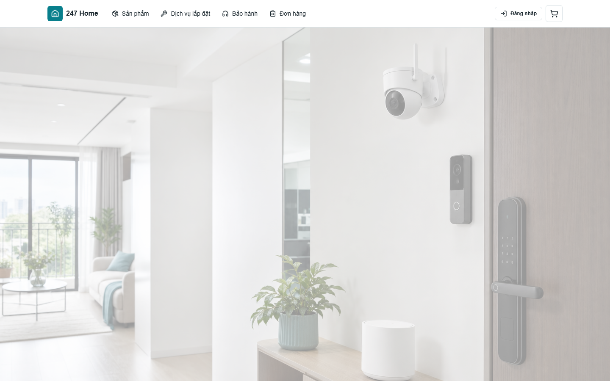
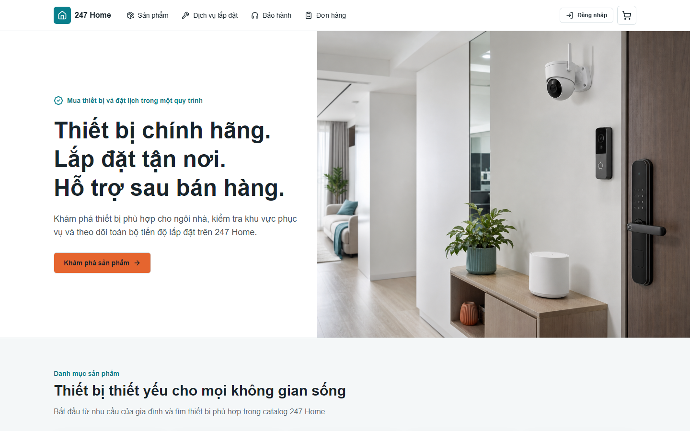
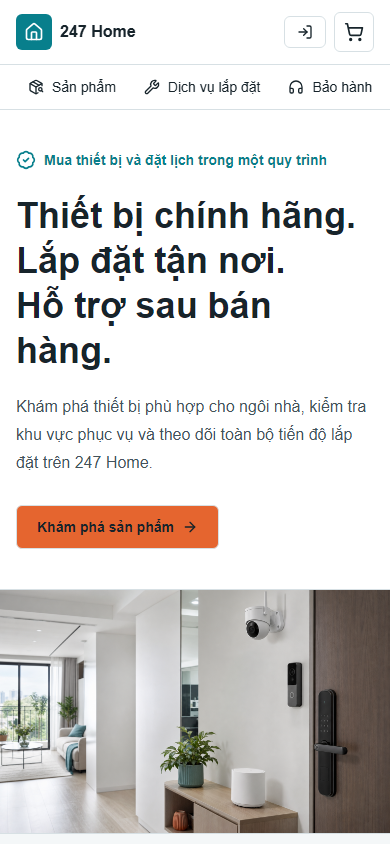

# Hero Section Fix Report

Date: 2026-07-16

## Status

**HERO SECTION READY**

## Problem

The hero image rendered as a normal 960-pixel-tall image in the production
container. The heading, description, and CTA began below it, making the homepage
look like an image banner followed by an unrelated landing-page section.

## Root Cause

`next/image` fill mode depended on inline positioning styles that were rejected
by the existing strict Content Security Policy. Computed browser geometry proved
that the image was static and the content container started after the image.

## Changes

- Rebuilt the hero as one section containing image and content layers.
- Desktop uses a 640-pixel composition with text on the left and the image on the
  right.
- Mobile and tablet use content followed by the image within the same hero.
- Image positioning uses `object-fit: cover` and `70% center`.
- Headline is deliberately split into the three approved lines on desktop.
- Removed the full-image white wash, restoring useful product detail and contrast.
- Added E2E geometry checks for desktop height, desktop side-by-side placement,
  mobile ordering, CTA visibility, asset loading, and horizontal overflow.

## Screenshots

### Before: desktop

### After: desktop

### After: mobile

## Verification

- `pnpm lint`: PASS
- `pnpm typecheck`: PASS
- `pnpm test`: PASS, 70/70
- `pnpm test:integration`: PASS, 53/53
- `pnpm test:e2e`: PASS, 21/21
- `pnpm build`: PASS
- Local production health and readiness: HTTP 200

The final E2E run used the rebuilt production-like Docker container. No retry or
timeout increase was used to hide layout failures.

## Database and Security

- Database changes: none.
- Migrations: none.
- CSP was not weakened; the component was changed to work within the existing
  policy.
- Authentication, authorization, APIs, and catalog services are unchanged.

## Remaining Risk

Automated checks cover Chromium at 390, 768, and 1440 pixels. A final review on
physical mobile/tablet devices and Safari remains recommended before a public
release.

## Rollback

Revert the hero block in `app/page.tsx`, the related homepage E2E assertions,
this report, the audit, and the generated screenshots. No database or backend
rollback is needed.
