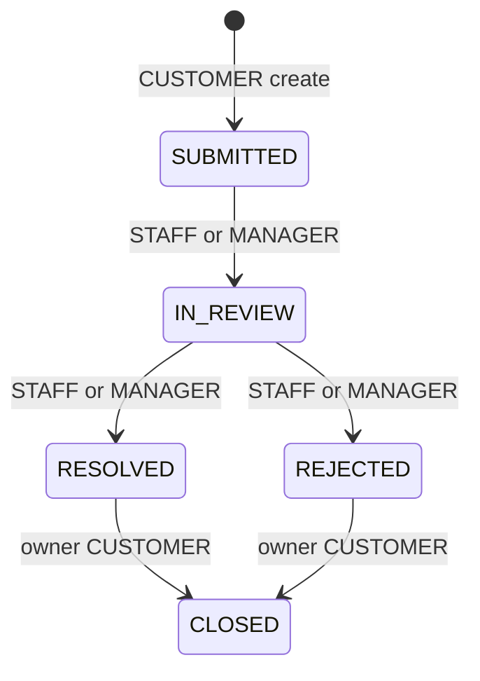

# Customer Warranty Backend Audit

Ngày hoàn tất: 2026-07-18

## 1. Kết luận kiến trúc

Customer Warranty được triển khai thành module `src/modules/warranty` trong modular
monolith hiện tại. Domain policy không phụ thuộc Next.js/Prisma; application service
sở hữu authorization, transaction, optimistic concurrency và audit; Route Handler
chỉ parse request, lấy actor Auth.js và ánh xạ HTTP.

Không thêm dependency. Storage tái sử dụng private object-storage port hiện có và
thêm namespace allowlist `warranty-evidence`.

## 2. Trạng thái trước thay đổi

- Schema có `warranty_requests` tối thiểu, chưa có version, eligibility snapshot,
  contact, resolution, rejected state hoặc evidence relation.
- Chỉ có Admin Operations list/detail read-only.
- Customer API được ghi là planned, chưa expose.
- `product_variants` và `order_items` chưa hiện thực `warranty_months` dù database
  design đã quy định trường này.

## 3. Kiến trúc hiện tại

| Layer | File | Trách nhiệm |
|---|---|---|
| Domain | `src/modules/warranty/domain/warranty-policy.ts` | Eligibility, duplicate decision, state/role transition |
| Application | `src/modules/warranty/application/warranty-service.ts` | Owner scope, transaction, conditional update, audit, storage compensation |
| Presentation | `src/modules/warranty/presentation/schemas.ts` | Zod strict body/query schemas và giới hạn input |
| HTTP | `app/api/v1/warranty/**` | Auth actor, HTTP status/envelope, private cache headers |
| Persistence | `prisma/schema.prisma` | Snapshot, unique guard, version và evidence metadata |
| Migration | `20260718100000_*`, `20260718101000_*` | Enum commit riêng; expand/backfill/constraint forward-only |

Checkout snapshot `product_variants.warranty_months` vào
`order_items.warranty_months`. Giá trị mặc định hiện tại là 12 tháng. Việc đổi policy
catalog sau này không sửa order cũ.

## 4. Eligibility

Request chỉ được tạo khi tất cả điều kiện đúng:

1. Order item thuộc order của customer hiện tại.
2. Order ở `COMPLETED` và có `completedAt`.
3. Snapshot `warrantyMonths > 0`.
4. Thời điểm hiện tại không sau `completedAt + warrantyMonths`.
5. Coverage `INSTALLATION` yêu cầu order item có service package snapshot.
6. Chưa có cùng `(customerUserId, orderItemId, coverageType)`.

Request lưu `coverageType`, `warrantyStartsAt`, `warrantyExpiresAt`; eligibility
không được tính lại từ catalog khi đọc. Unique index PostgreSQL là guard chống hai
request đồng thời; pre-check chỉ tạo lỗi dễ hiểu.

## 5. State machine

- `CLOSED` là terminal; `REJECTED` chỉ cho owner đóng để xác nhận đã xem kết quả.
- ADMIN và TECHNICIAN bị từ chối mutation.
- Customer không được ghi `publicResolution` hoặc `internalNote`.
- Resolve/reject yêu cầu public resolution.
- Mutation dùng conditional `updateMany(id, status, expectedVersion)`; count khác 1
  trả `409 CONCURRENT_MODIFICATION`.
- State, version, lifecycle timestamp và audit commit trong cùng transaction.

## 6. API contract

Prefix triển khai là `/api/v1/warranty`:

| Method | Endpoint | Kết quả chính |
|---|---|---|
| GET | `/warranty?status=&cursor=&limit=` | Owner list, cursor pagination |
| GET | `/warranty/{id}` | Owner detail, tối đa 25 evidence metadata gần nhất |
| POST | `/warranty` | Create `201` hoặc idempotent replay `200` |
| POST | `/warranty/{id}/evidence` | Owner upload, `201`, version tăng |
| GET | `/warranty/{id}/evidence/{evidenceId}` | Authorized private preview |
| PATCH | `/warranty/{id}/state` | Conditional state transition |
| GET | `/warranty/{id}/audit?cursor=&limit=` | Owner-visible redacted timeline |

Mutation bắt buộc allowed Origin và `application/json`, có body cap và rate-limit
scope riêng. Status chính: `200`, `201`, `400`, `401`, `403`, `404`, `409`, `413`,
`415`, `429`, `503`. Response authenticated luôn `Cache-Control: private, no-store`.

Chi tiết JSON nằm tại `docs/API_CONTRACT.md`.

Create chính dùng `orderId + productId`; `orderItemId` được giữ làm compatibility
contract. `Idempotency-Key` dài 16..128 ký tự thuộc allowlist là bắt buộc ở HTTP.
Hash key và canonical payload được lưu; raw key/description không được log. Partial
unique index theo customer đảm bảo hai request đồng thời chỉ tạo một row/audit.

## 7. Evidence flow

1. Zod giới hạn JSON base64 và filename.
2. Storage validator chặn path separator, extension/MIME mismatch, signature sai,
   base64 sai và decoded image lớn hơn 5 MiB.
3. Server sinh UUID object key trong `warranty-evidence/`.
4. Transaction conditional-increment request version, ghi evidence metadata và
   append audit.
5. Nếu transaction thất bại, `uploadAndPersist` xóa object vừa upload; nếu cleanup
   cũng thất bại, trả `AggregateError` giữ cả hai nguyên nhân.
6. Preview kiểm owner/Operations-read trước khi download; physical path/storage key
   không xuất hiện trong response.

Supported type: JPEG, PNG, WebP. PDF và active document bị từ chối để giữ threat
surface nhỏ; production malware scanning/retention chưa được phê duyệt.

## 8. Security matrix

| Actor | List/detail/audit customer API | Create/evidence | State mutation |
|---|---|---|---|
| Owner CUSTOMER | Yes | Yes | Chỉ `RESOLVED|REJECTED -> CLOSED` |
| Other CUSTOMER | `404` | Own order only | `404` |
| STAFF | Không qua customer read API | No | Process allowed transitions |
| MANAGER | Không qua customer read API | No | Process allowed transitions |
| TECHNICIAN | No | No | `403` |
| ADMIN | Existing Admin read endpoints; preview read | No | `403` |

Customer DTO không select `internalNote`, assigned staff metadata, audit before/after,
storage key hoặc filesystem path. Audit customer chỉ trả action, actor name và time.

## 9. Migration strategy

- `REJECTED` được thêm trong migration riêng để enum value commit trước constraint.
- Migration kế tiếp chỉ add column/type/table/index và backfill; không drop, truncate,
  reset hoặc đổi state lịch sử.
- Request cũ được backfill `DEVICE`, contact từ order snapshot, start từ
  `completedAt` hoặc fallback `createdAt`, expiry theo item snapshot.
- Migration fail rõ trước constraint nếu request cũ không link được order hoặc có
  duplicate coverage.
- Forward-fix/partial-deploy/post-check nằm trong migration `README.md`.
- Migration `20260718120000_warranty_create_idempotency` thêm hash nullable cho row
  mới, partial unique index và mở lifecycle constraint để đóng kết quả rejected;
  không backfill key giả cho lịch sử.

## 10. Test coverage

| Requirement | Regression test |
|---|---|
| Eligibility/calendar expiry | `tests/unit/warranty-policy.test.ts` |
| Duplicate decision | `tests/unit/warranty-policy.test.ts` |
| State/role machine | `tests/unit/warranty-policy.test.ts` |
| Snapshot, duplicate DB guard, owner create | `tests/integration/warranty.test.ts` |
| Owner list/detail/audit + IDOR | `tests/integration/warranty.test.ts` |
| Concurrent state transition/version/audit | `tests/integration/warranty.test.ts` |
| Evidence upload/preview/cleanup race | `tests/integration/warranty.test.ts` |
| HTTP 200/201/400/403/404/409/415 + cache | `tests/integration/warranty-api.test.ts` |
| Concurrent idempotent create + one audit | `tests/integration/warranty.test.ts` |

## 11. Residual risks và human review

1. **Product policy:** mặc định 12 tháng cần Product Owner phê duyệt trước production.
2. **Exact day policy:** calendar-month expiry có clamp cuối tháng; grace period và
   timezone pháp lý chưa được định nghĩa.
3. **Retention/privacy:** thời hạn giữ warranty description, phone, evidence và audit
   chưa được Legal/Product phê duyệt.
4. **Malware:** signature validation giảm spoofing nhưng không thay thế malware scan.
5. **Rate limiter:** adapter in-memory hiện tại không phù hợp production multi-instance.
6. **Admin processing UI:** task này chỉ cung cấp backend; Operations customer warranty
   action UI chưa nằm trong phạm vi.

## 12. Verification

Các command chạy trên repository hiện tại sau migration cuối:

| Command | Kết quả |
|---|---|
| `pnpm db:migrate` | PASS; 14 migrations, không còn migration pending |
| `pnpm lint` | PASS; 0 warning/error |
| `pnpm typecheck` | PASS |
| `pnpm test` | PASS; 23 files, 81 tests |
| `pnpm test:integration` | PASS; 9 files, 62 tests trên PostgreSQL |
| `pnpm test:e2e` | PASS; 42/42 trên server mới từ working tree |
| `pnpm build` | PASS; Next.js production build và route collection thành công |

Targeted warranty trước full suite:

- Unit policy: 5/5 pass.
- Warranty service + HTTP contract integration: 9/9 pass.

## 13. Final status

**CUSTOMER WARRANTY BACKEND SLICE READY**

Status này áp dụng cho backend/API. Customer Warranty UI vẫn là vertical slice riêng.
